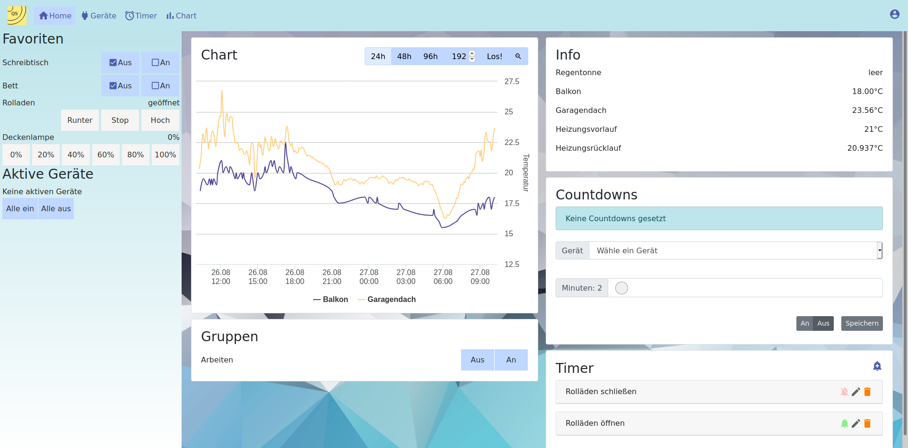
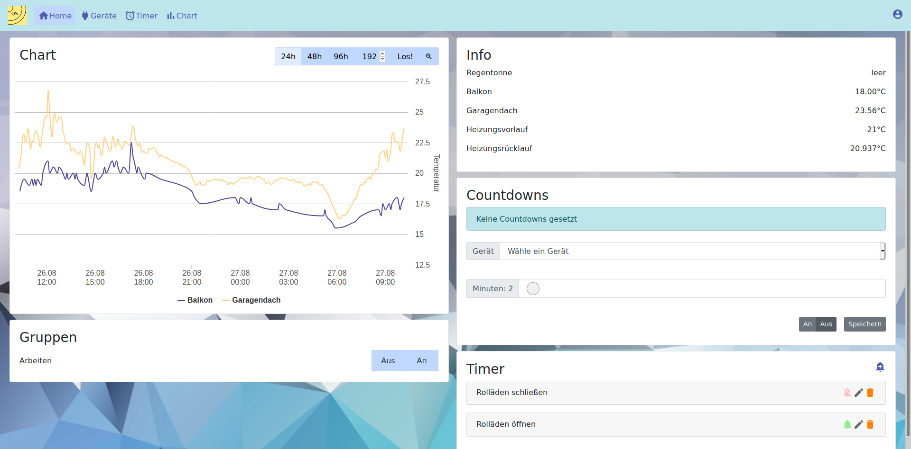
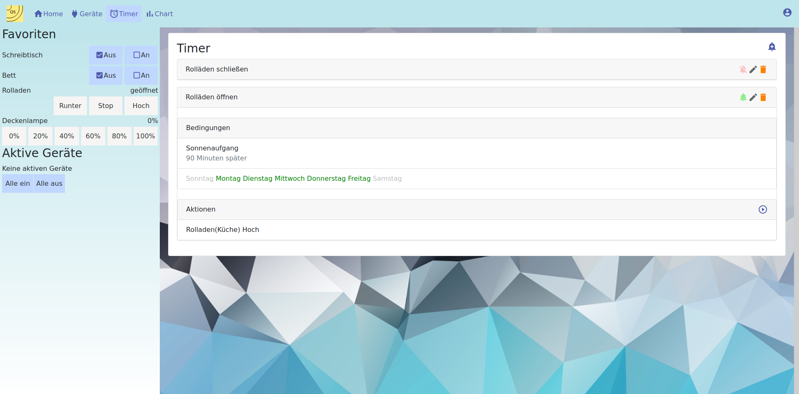

# qs-webview

This adapter is for [QuickSwitch2.0](https://github.com/dede53/QuickSwitch2.0) and is depending on it -> you cannot use it without!

It provides the following features:

* multi-user-interface
* chart history of saved data (e.g temperatures, amount of rain, used water/gas/energy)
* list of all available devices sorted by room
* notifications
* edit/add/remove timer (do an action depending on time/variable/calender/etc) 
* favorite devices depending the user
* list of all active devices
* chat integration of a [telegram](http://telegram.org) group
* Functions depending on the selected user:
    * List of most used devices
    * List of interesting Datasets (temperatures, rainmeter,...)
    * background image
    * groups of devices
    * countdowns (a device switches of after a certain amount of time)

## Screenshots
The main view:

The main view without the favorite panel on the left:

The Interface to manage automated actions:

# Developer informations:

This project was generated with [Angular CLI](https://github.com/angular/angular-cli) version 10.0.5.

## Development server

Run `ng serve` for a dev server. Navigate to `http://localhost:4200/`. The app will automatically reload if you change any of the source files.

## Code scaffolding

Run `ng generate component component-name` to generate a new component. You can also use `ng generate directive|pipe|service|class|guard|interface|enum|module`.

## Build

Run `ng build` to build the project. The build artifacts will be stored in the `dist/` directory. Use the `--prod` flag for a production build.

## Running unit tests

Run `ng test` to execute the unit tests via [Karma](https://karma-runner.github.io).

## Running end-to-end tests

Run `ng e2e` to execute the end-to-end tests via [Protractor](http://www.protractortest.org/).

## Further help

To get more help on the Angular CLI use `ng help` or go check out the [Angular CLI README](https://github.com/angular/angular-cli/blob/master/README.md).
